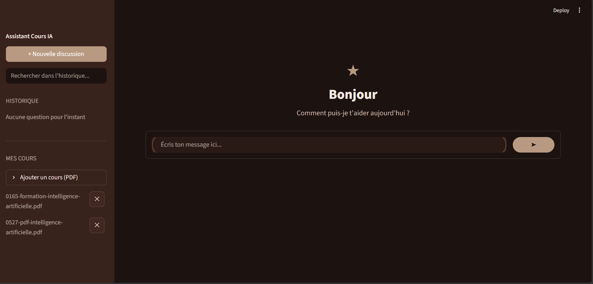
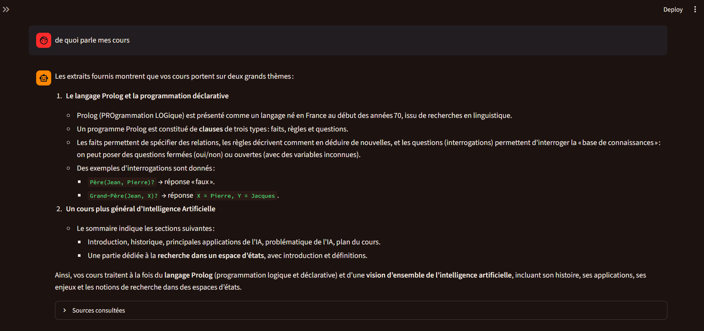
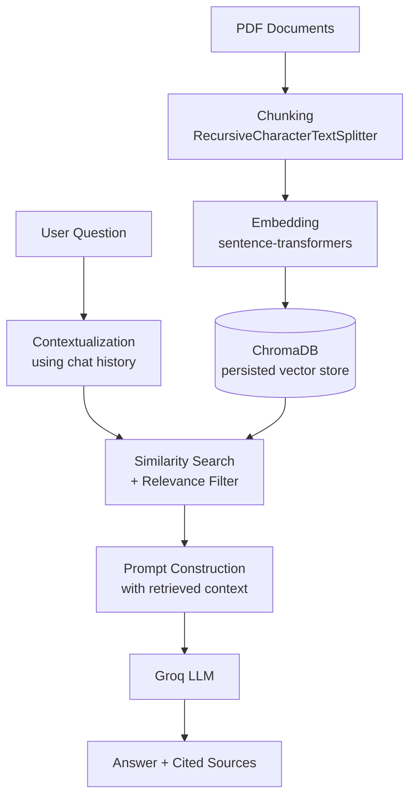

# RAG AI Course Assistant




A Retrieval-Augmented Generation (RAG) system that answers questions about AI/ML course material using only the content of provided PDF documents ,no hallucinated answers, with source citations for every response.

## Features

- **PDF ingestion pipeline**: automatic chunking and vector indexing of course documents
- **Semantic search**: retrieves the most relevant passages using sentence embeddings (not just keyword matching)
- **Grounded generation**: answers are generated strictly from retrieved context via Groq's LLM API
- **Relevance filtering**: detects when a question is out of scope and explicitly says so, instead of hallucinating
- **Conversational memory**: follow-up questions are contextualized using recent chat history
- **Source transparency**: every answer displays the exact document and page it was extracted from
- **Live document management**: add or remove course PDFs directly from the interface, with automatic re-indexing
- **Chat interface**: built with Streamlit, styled with a custom dark theme

## Tech stack

| Component         | Technology                          |
|--------------------|--------------------------------------|
| Orchestration      | LangChain                            |
| Embeddings         | sentence-transformers (`all-MiniLM-L6-v2`) |
| Vector store        | ChromaDB                             |
| LLM inference       | Groq API (`openai/gpt-oss-120b`)     |
| PDF parsing         | pdfplumber                           |
| Interface           | Streamlit                            |

## Architecture


## Getting started

### Prerequisites

- Python 3.11+
- A free [Groq API key](https://console.groq.com)

### Installation

```bash
git clone https://github.com/youmbidan/rag-ai-course-assistant.git
cd rag-ai-course-assistant

python -m venv venv
venv\Scripts\activate        # Windows
# source venv/bin/activate   # macOS/Linux

python -m pip install -r requirements.txt
```

### Configuration

Copy `.env.example` to `.env` and add your Groq API key:

GROQ_API_KEY=your_key_here


### Add your course PDFs

Place PDF files in `data/pdfs/`, or add them later directly from the app's sidebar.

### Build the initial index

```bash
python -m src.ingest
```

### Run the app

```bash
streamlit run app.py
```

## Known limitations

- Relevance threshold is tuned for the `all-MiniLM-L6-v2` embedding model; results may need recalibration with a different embedding model
- Adding or removing a document triggers a full re-index rather than an incremental update fine for small document sets, not optimized for large ones
- No automated evaluation suite yet (planned improvement)

## Possible improvements

- Automated retrieval evaluation (test questions with expected sources)
- Incremental indexing instead of full rebuilds
- Support for additional document formats (DOCX, PPTX)

---

## À propos (FR)

Ce projet est un système RAG (Retrieval-Augmented Generation) qui répond à des questions sur des supports de cours IA/ML en se basant uniquement sur le contenu réel des documents fournis.